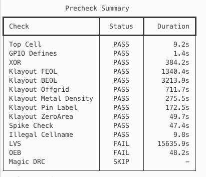
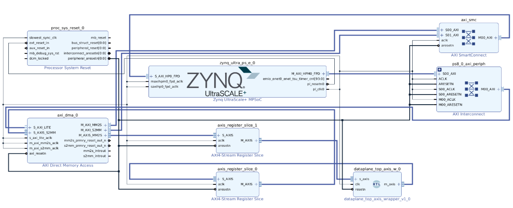
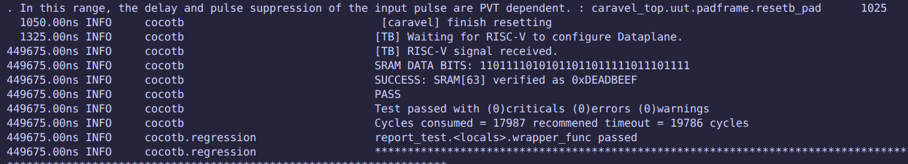
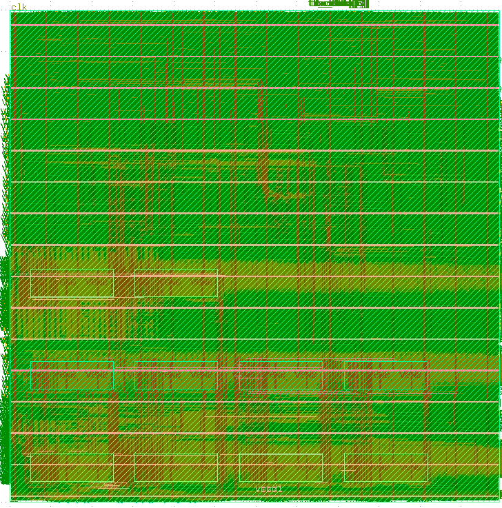
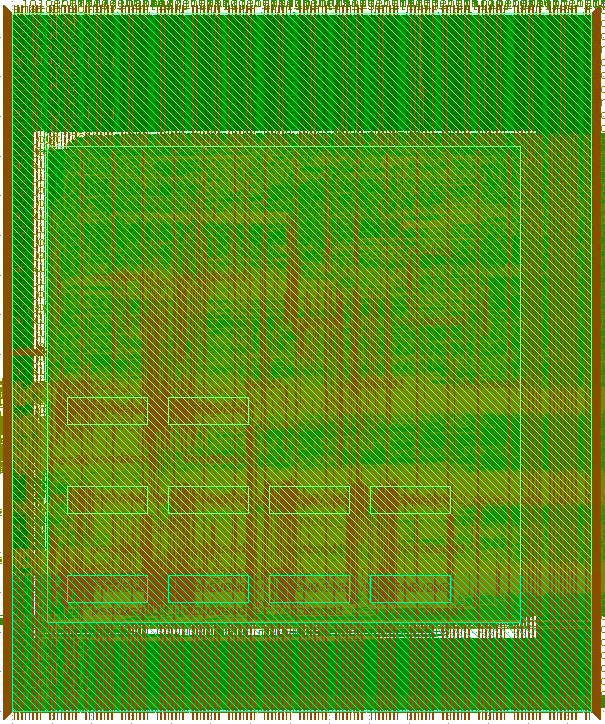
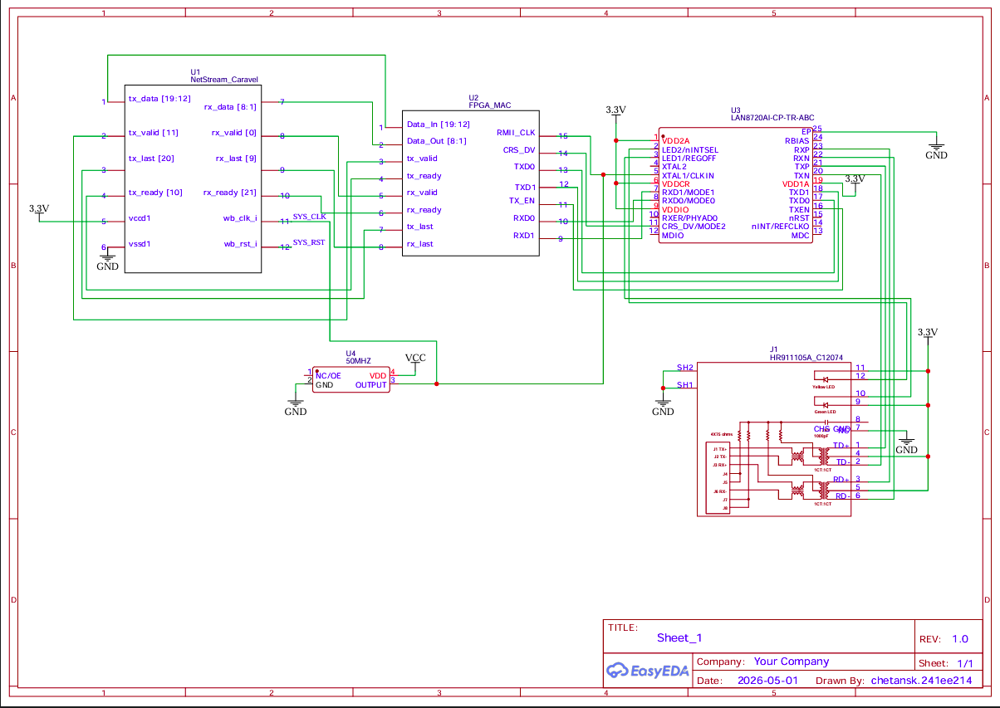

# NetStream: Caravel-Based Edge Network Packet-Processing Accelerator

## Overview

NetStream is a hardware-accelerated network packet-processing engine designed for edge IoT and industrial gateway applications, implemented within the Caravel SoC framework.

Modern edge and industrial systems increasingly require real-time network functions such as:
- Packet filtering  
- QoS (Quality of Service) enforcement  
- Traffic classification  
- Secure flow management  

These systems operate under strict:
- Latency constraints  
- Power constraints  
- Cost constraints  

In conventional software-based implementations, these tasks are executed on general-purpose CPUs, where packet-processing workloads suffer from irregular memory accesses, poor cache locality, and branch-heavy control flow. As traffic volume and rule complexity increase, software approaches struggle to sustain throughput and deterministic response times, leading to higher latency, increased CPU utilization, and limited scalability.

NetStream addresses these limitations by offloading packet parsing, classification, and action execution into a dedicated streaming hardware datapath. The architecture combines programmable TCAM-based rule matching, pipelined packet processing, and hardware action execution to enable low-latency, high-throughput packet handling with reduced CPU involvement.

The design follows a clear separation between control plane and data plane. The Caravel management SoC acts as the programmable control plane responsible for rule configuration and system management, while the NetStream datapath performs real-time packet inspection and processing entirely in hardware.

Unlike traditional hardware-accelerated networking solutions such as SmartNICs and programmable switches, which are typically optimized for data center environments, often involving higher cost, increased power consumption, complex integration, and reliance on specialized toolchains. NetStream targets compact and resource-constrained edge deployments. The system is designed to integrate with external Ethernet MAC and PHY components and operate as part of a complete edge networking platform, providing deterministic packet processing in a cost-effective, power-efficient and scalable architecture.

---

## Current Status

| Component | Status |
|---|---|
| RTL datapath implementation | Completed |
| DFFRAM macro integration for TCAM and action memories | Completed |
| Multi-packet dataplane verification | Completed |
| FPGA validation on PYNQ Z2 | Completed |
| OpenLane RTL-to-GDSII flow for dataplane | Completed |
| Caravel management SoC integration with dataplane | Completed |
| Verification of register writes from Caravel CPU to TCAM and action memories using Cocotb and custom firmware | Completed |
| Hardening of `user_project_wrapper` with dataplane macro | Completed |
| Caravel precheck | In Progress (12/13 PASS) |
| PCBA Integration | In Progress |
---

Precheck status:




## System Architecture

NetStream is a hardware-accelerated streaming packet-processing engine integrated within the Caravel user project area. The architecture follows a clear separation between the control plane and data plane:

- The Caravel RISC-V management core acts as the control plane, responsible for:
  - Rule configuration  
  - Action memory updates  
  - Policy management  
  - System monitoring and debugging  

- The NetStream datapath operates as the data plane, performing:
  - Packet parsing  
  - Header extraction  
  - Packet classification  
  - Action execution  

Packet processing is fully offloaded to hardware, reducing CPU involvement and enabling deterministic low-latency operation.
At a high level, packets enter the system from an external Ethernet PHY through a MAC interface that presents packet data as a byte stream along with standard handshake signals (`valid`, `ready`, `last`).


---

### Packet Processing Pipeline

- **Ingress Interface & Buffering**  
   Incoming packet data is received through the MAC interface and buffered using an ingress FIFO to decouple I/O timing from internal processing.

- **Header Extraction & Parsing**  
   The packet stream is fed into a header buffer, where the header bytes are buffered before being forwarded to the parser FSM that extracts relevant header fields (e.g., protocol, addresses, ports) and formats them into structured metadata.

- **Key Generation**  
   A key builder module constructs a lookup key from the extracted metadata, which is used for rule matching.

- **TCAM-based Rule Matching Engine**  
   The generated key is matched against a programmable rule table (TCAM memory-based rule matching is done) , enabling fast, parallel classification of packets based on pre-defined policies.

- **Action Engine**  
   Based on the matched rule, an action is selected from an action memory. Examples of supported actions include forwarding, dropping, tagging, or modifying packet metadata.

- **Packet Buffering & Action Application**  
   In parallel with header processing, the full packet is being stored in a data FIFO. Once the corresponding action decision is available, the packet stored is forwarded from the FIFO to an action multiplexer which applies the selected operation to the buffered packet.

- **Egress Path**  
   The processed packet is transmitted through the egress interface back to the MAC and subsequently to the external PHY.

---

### Key Architectural Characteristics

- **Throughput and Bandwidth**

| Parameter | Value |
|---|---|
| Data width | 8 bits (1 byte/cycle) |
| Clock period | 25 ns (Can be decreased upto 14 ns) |
| Operating frequency | 40 MHz |
| Peak throughput | ~320 Mbps |
| Processing style | Fully pipelined |

---

- **I/O Constraints and External Interface Assumptions**

Packet I/O is mapped through Caravel user I/O pins. Current design uses serialized 8-bit streaming interface. NetStream interfaces with an external Ethernet MAC and PHY in a PCB-level deployment.

Due to the limited GPIO bandwidth available on the Caravel platform, the ASIC does not directly implement a full Ethernet MAC interface. 
Instead, NetStream exposes a lightweight streaming datapath interface consisting of `data`, `valid`, `ready`, `last` signals.

An external RMII-compatible lightweight Ethernet MAC is used to connect the Ethernet PHY to the NetStream datapath.

System integration is as follows:

Ethernet PHY -- RMII MAC -- NetStream ASIC 

---

- **Deterministic Latency:**

| Parameter | Value |
|---|---|
| Pipeline depth (worst case) | ~246 cycles |
| Clock period | 25 ns |
| Operating frequency | 40 MHz |
| Worst-case latency | ~6.15 µs |

The latency is deterministic and largely independent of packet length due to the streaming pipeline architecture and early action resolution mechanism.

---

- **Custom DFFRAM-Based Memory Architecture**

The TCAM and action memories were implemented using custom-generated 32×32 DFFRAM macros instead of larger pre-generated SRAM configurations.
Smaller custom DFFRAM blocks were selected to better match the storage requirements of the dataplane while remaining within the area constraints of the Caravel user project area.
The design currently uses:
- 8 DFFRAM macros for TCAM storage  
- 2 DFFRAM macros for action memory storage

This modular memory organization enabled:
- Improved area efficiency  
- Better floorplanning flexibility  
- Reduced routing complexity  
- Easier timing optimization through pipelined lookup stages

The transition from an earlier combinational lookup architecture to a pipelined DFFRAM-based implementation significantly improved timing performance and enabled successful timing closure under nominal conditions.

---

- **Caravel Integration**

NetStream is implemented within the Caravel user project area and interfaces with the Caravel management SoC through a Wishbone slave interface.
The Caravel RISC-V management core acts as the control plane and is responsible for:
- Configuring TCAM rule tables  
- Updating action memory entries  
- System monitoring and debugging  
Configuration and control are performed through memory-mapped Wishbone registers exposed by the NetStream datapath.

### System Summary

| Parameter | Value |
|---|---|
| Control plane | Caravel RISC-V management SoC |
| Data plane | Fully pipelined NetStream datapath |
| Processing pipeline depth | ~246 cycles |
| Data width | 8 bits (1 byte/cycle) |
| Clock period | 25 ns |
| Operating frequency | 40 MHz |
| Peak throughput | ~320 Mbps |
| Worst-case latency | ~6.15 µs |
| Packet interface | Streaming byte interface (`data`, `valid`, `ready`, `last`) |
| External connectivity | RMII/MII-compatible Ethernet MAC + PHY |
| Memory implementation | Custom 32×32 DFFRAM macros |
| TCAM memory organization | 8 DFFRAM macros |
| Action memory organization | 2 DFFRAM macros |
| Processing style | Fully pipelined streaming architecture |

---

## Block Diagram Of Architecture


---


# Verification and Validation

NetStream has been functionally verified across RTL simulation, FPGA deployment, and ASIC implementation stages to validate correct packet-processing behavior, datapath synchronization, and system-level integration.

---

## RTL Verification 

Functional verification was performed using custom Verilog testbenches. We have achieved a good coverage across most edge cases and continuous packet loads.

The following datapath features were verified:

- Packet parsing and header extraction  
- Metadata generation and key formation  
- TCAM-based rule matching  
- Action selection and packet rewrite operations  
- Packet forwarding and dropping behavior  
- Valid-ready handshake functionality  
- FIFO synchronization across pipeline stages  
- Multi-packet processing behavior  

Representative test scenarios included:

- Valid packet streams with rule matches  
- No-match/default-action behavior  
- Backpressure and stall conditions  
- Packet rewrite and metadata modification operations

Packet Processing and Action Application


- **Summary**

| Feature | Description | Status |
|--------|------------|--------|
| Packet parsing | Header extraction and metadata generation | PASS |
| Key generation | Correct key formation from parsed fields | PASS |
| TCAM matching | Rule lookup and match detection | PASS |
| Action execution | Forward / drop / modify operations | PASS |
| Packet buffering | FIFO alignment with action resolution | PASS |
| Multi-packet pipeline | Multiple packets in-flight | PASS |
| Backpressure handling | Valid/ready behavior under stalls | PASS |
| Corner cases | Malformed / edge packets | PASS |

### Example Test Case

- Input: IPv4 packet with destination port = 80  
- Rule: Match on destination port = 80 → action = modify DSCP  
- Expected Behavior:
  - Packet matched in TCAM  
  - Action selected correctly  
  - DSCP field modified in output packet  

Observed result matches expected behavior as verified in waveform.

---

## FPGA Validation

The NetStream datapath was validated on the Xilinx PYNQ Z2 FPGA platform.

Validation included:

- Successful synthesis and implementation  
- Real-time packet processing verification  
- Streaming datapath validation  
- Multi-packet pipeline operation  
- FIFO/action synchronization testing  

FPGA testing also helped identify real-time synchronization issues not visible during RTL simulation, leading to improvements in packet buffering and early action-resolution mechanisms.



---

## Caravel Integration Verification

Integration with the Caravel management SoC was verified using Cocotb and custom firmware running on the Caravel RISC-V processor.

The following features were validated:

- Wishbone communication  
- Register read/write functionality  
- TCAM rule programming  
- Action memory configuration  
- Control-plane to dataplane interaction  

The dataplane macro was successfully integrated and hardened within the `user_project_wrapper`.




---


# ASIC Implementation Results (Dataplane Macro)

The NetStream dataplane was implemented using the OpenLane RTL-to-GDSII flow targeting the SKY130 technology node.

The backend flow included:

- RTL synthesis with custom DFFRAM macro integration
- Floorplanning and macro placement  
- Clock-tree synthesis (CTS)  
- Global and detailed routing  
- Static Timing Analysis (STA)  
- IR-drop and power analysis  
- DRC/LVS verification  
- Final GDSII generation  

The dataplane was first hardened as a standalone macro before integration into the Caravel `user_project_wrapper`.

---

## Backend Architecture 

The original dataplane used a combinational TCAM implementation, which resulted in significant timing violations and poor scalability.

To improve timing performance, the TCAM and action memories were redesigned using custom-generated 32×32 DFFRAM macros integrated into a pipelined lookup architecture.

The final dataplane implementation uses:

- 8 DFFRAM macros for TCAM storage  
- 2 DFFRAM macros for action memory storage  

This transition significantly improved timing performance and enabled successful timing closure at the nominal TT corner.

---

## Physical Design Summary

| Metric | Value |
|---|---|
| Technology node | SKY130 |
| RTL-to-GDSII flow | OpenLane |
| Die area | ~5.72 mm² |
| Core area | ~5.64 mm² |
| Total instance area | ~2.97 mm² |
| Standard-cell area | ~2.42 mm² |
| DFFRAM macro area | ~0.55 mm² |
| Standard-cell utilization | ~47.5% |
| Total utilization | ~52.6% |
| Total instances | ~395k |
| Number of macros | 10 |
| I/O count | 296 |

---

## Timing Results

Static Timing Analysis (STA) was performed using OpenSTA at the nominal TT corner.

### Timing Summary

| Metric | Value |
|---|---|
| Clock period | 25 ns |
| Operating frequency | 40 MHz |
| Setup violations | 0 |
| Hold violations | 0 |
| Worst setup slack | +3.69 ns |
| Worst hold slack | +0.20 ns |
| Setup TNS | 0 |
| Hold TNS | 0 |

The pipelined DFFRAM-based lookup architecture significantly reduced the critical path compared to the earlier combinational TCAM implementation.

---

## Routing and Physical Verification

Routing was successfully completed with zero final routing DRC violations.

### Routing Summary

| Metric | Value |
|---|---|
| Final routing DRC errors | 0 |
| Total routed nets | ~133k |
| Total wirelength | ~7.34M |
| Total vias | ~1.23M |

### Verification Summary

| Check | Status |
|---|---|
| KLayout DRC | PASS |
| LVS | PASS |
| XOR comparison | PASS |
| Power-grid violations | 0 |
| Final routing DRC | PASS |

---

## Power and IR-Drop Analysis

| Metric | Value |
|---|---|
| Total power | ~0.15 W |
| Internal power | ~0.10 W |
| Switching power | ~0.048 W |
| Leakage power | ~2.6 µW |
| Worst IR drop | ~1.07 mV |

IR-drop and power-grid analysis indicate stable power delivery across the dataplane macro under nominal operating conditions.




---

# Caravel User Project Wrapper Hardening

After standalone hardening of the NetStream dataplane macro, the design was integrated into the Caravel `user_project_wrapper` to validate compatibility with the Caravel management SoC and full chip-level integration flow.

The hardened dataplane macro was instantiated within the Caravel user project area and connected through:

- Wishbone control interface  
- Caravel clock and reset infrastructure  
- User I/O interfaces  
- Power-grid integration  

The wrapper-level implementation was then taken through the OpenLane RTL-to-GDSII flow to validate chip-level integration, timing behavior, routing feasibility, and physical verification compatibility.

---

## Wrapper-Level Integration Summary

| Metric | Value |
|---|---|
| Technology node | SKY130 |
| RTL-to-GDSII flow | OpenLane |
| Die area | ~10.28 mm² |
| Core area | ~10.17 mm² |
| Integrated macros | 1 (NetStream dataplane macro) |
| Macro area | ~5.72 mm² |
| Wrapper I/O count | 645 |
| Total utilization | ~57.1% |

---

## Timing Results

Static Timing Analysis (STA) was performed at the nominal TT corner after wrapper-level integration.

### Timing Summary

| Metric | Value |
|---|---|
| Clock period | 25 ns |
| Operating frequency | 40 MHz |
| Setup violations | 0 |
| Hold violations | 0 |
| Worst setup slack | +5.96 ns |
| Worst hold slack | +0.11 ns |
| Setup TNS | 0 |
| Hold TNS | 0 |

The integrated wrapper successfully achieved nominal-corner timing closure without setup or hold violations.

---

## Routing and Physical Verification

Routing and physical verification were completed successfully for the integrated wrapper design.

### Physical Verification Summary

| Check | Status |
|---|---|
| Final routing DRC | PASS |
| KLayout DRC | PASS |
| LVS | PASS |
| XOR comparison | PASS |
| Power-grid violations | 0 |

### Routing Summary

| Metric | Value |
|---|---|
| Final routing DRC errors | 0 |
| Total routed nets | ~1.8k |
| Total wirelength | ~258k |
| Total vias | ~8k |

---

## Power and IR-Drop Analysis

| Metric | Value |
|---|---|
| Total power | ~1.12 mW |
| Worst IR drop | ~0.8 mV |

Power-grid and IR-drop analysis indicate stable operation under nominal conditions after full wrapper-level integration.



---


## Current Status 

The NetStream dataplane macro has been successfully integrated and hardened within the Caravel `user_project_wrapper`.

Current progress includes:

- Wrapper-level RTL-to-GDSII completion  
- Nominal-TT corner timing closure  
- Klayout DRC/LVS-clean implementation  
- Wishbone-connected control-plane integration  

Final Caravel precheck and additional multi-corner optimization are currently in progress.


---

# System-Level PCB Integration

To demonstrate deployment feasibility beyond standalone ASIC implementation, a system-level PCB integration architecture was developed for NetStream. It is being implemented on EasyEDA.

The proposed hardware platform integrates the Caravel-based NetStream ASIC with an external Ethernet PHY and an FPGA-based Ethernet MAC subsystem. 

The FPGA acts as a lightweight bridge between the Ethernet PHY and the NetStream datapath by:

- Implementing the Ethernet MAC layer  
- Handling RMII communication with the PHY  
- Converting Ethernet frames into the streaming datapath interface required by NetStream  

The NetStream ASIC performs hardware-accelerated packet parsing, classification, and action execution, while the Caravel RISC-V management processor configures TCAM rules and action-memory entries through the Wishbone control interface.

---

## EasyEDA Schematic



The complete system architecture is organized as follows:

```text
RJ45 Connector
       │
       ▼
Ethernet PHY (LAN8720)
       │ RMII
       ▼
FPGA MAC Subsystem
(MAC + Stream Bridge)
       │ Streaming Interface
       ▼
NetStream ASIC
(Caravel-based)
```

---


## Deliverables

The final submission provides a complete, reproducible reference design spanning silicon, system integration, and documentation.

- **GDSII Layout:**  
  Tapeout-ready layout generated using OpenLane (SKY130)

- **RTL Source Code:**  
  Verilog implementation of the NetStream datapath, including both the initial working prototype and refined versions  

- **Verification Suite:**  
  Testbenches for RTL and Gate-Level Simulation (GLS), along with representative waveform results demonstrating pipeline operation  

- **PCB schematic and layout files**
    
- **FPGA MAC integration framework**
    
- **Firmware for TCAM/action programming**  

The project aims to deliver not just a functional chip, but an edge networking system that is reproducible and can be scaled.

---

## Target Applications

### 1. Industrial Edge Gateway (Deterministic Filtering)

NetStream can be deployed within industrial gateways that connect field devices (PLCs, sensors) to higher-level networks.

- Role: Enforce strict communication policies (allow/deny rules) at line rate  
- Problem: Software-based filtering introduces latency and unpredictability  
- Benefit: Deterministic, low-latency packet classification independent of CPU load  


### 2. QoS Pre-Processing Engine (Traffic Classification)

NetStream performs early packet classification before packets reach the main networking stack.

- Role: Modify packet metadata (e.g., DSCP tagging) based on rules  
- Problem: CPU-based classification is expensive and scales poorly  
- Benefit: Offloads classification, allowing the OS/network stack to focus only on scheduling  


### 3. Lightweight Edge Firewall (Rule-Based Filtering)

NetStream acts as a hardware firewall in resource-constrained edge devices.

- Role: Drop or allow packets based on configurable rule tables  
- Problem: Traditional firewall processing consumes CPU and memory bandwidth  
- Benefit: High-throughput filtering with minimal CPU involvement  


### 4. IoT Data Filtering and Pre-Processing

Used in IoT gateways to reduce unnecessary upstream traffic.

- Role: Filter, tag, or modify packets before forwarding to cloud  
- Problem: Sending all data upstream increases bandwidth and processing cost  
- Benefit: Local processing reduces bandwidth usage and improves responsiveness  


### 5. Deterministic Policy Engine for Edge Networks

NetStream can function as a programmable match-action engine for enforcing network policies.

- Role: Apply rule-based actions with fixed latency  
- Problem: Software systems introduce variability in processing time  
- Benefit: Predictable latency (~6.15 µs worst case) enables time-sensitive applications  


## System Feasibility and Bill of Materials (BOM)

NetStream is designed as a deployable hardware accelerator for edge-networking and industrial-IoT systems.

Tapeout and fabrication costs are excluded from the BOM, as fabrication is assumed to be performed through shared MPW programs and does not reflect the deployment cost of the system itself.

---

### Hardware Components

| Component | Description | Component | Estimated Cost (USD) |
|---|---|---|---|
| NetStream ASIC (Caravel-based) | Hardware packet-processing accelerator | MPW fabricated chip | Excluded |
| Ethernet PHY | Physical-layer Ethernet interface | LAN8720, DP83848 | 2 – 5 |
| FPGA (MAC subsystem) | Ethernet MAC + stream bridge | Lattice iCE40 / ECP5 | 8 – 20 |
| FPGA Configuration Flash | FPGA boot configuration storage | W25Q128 | 1 – 3 |
| RJ45 + Magnetics | Ethernet connector interface | Integrated MagJack | 2 – 6 |
| Power Management | Regulators and filtering circuitry | LDO/DC-DC modules | 3 – 8 |
| Oscillator and Clocking | System and RMII clock generation | 25/50 MHz oscillator | 1 – 3 |
| PCB and Passive Components | PCB fabrication and passives | 4-layer PCB | 10 – 25 |

---

### Estimated System Cost (Excluding ASIC Fabrication)

| Configuration | Estimated Cost (USD) |
|---|---|
| Minimal prototype platform | ~25 – 45 |
| FPGA-enhanced development platform | ~40 – 70 |

---

### Deployment Model

NetStream operates as a hardware accelerator within an edge gateway:

- PHY handles physical signaling  
- MAC converts Ethernet frames into a byte-stream interface  
- NetStream performs packet classification and action execution  
- Host CPU manages control plane and networking stack  

This modular architecture enables cost-effective deployment while maintaining flexibility and scalability.

---

##  Timeline

- Proposal Submission: March 25
- RTL + Verification: April
- Tapeout Submission: April 30

---

##  License

Apache 2.0 

---

##  Author

Adhitya Santhanam

---

