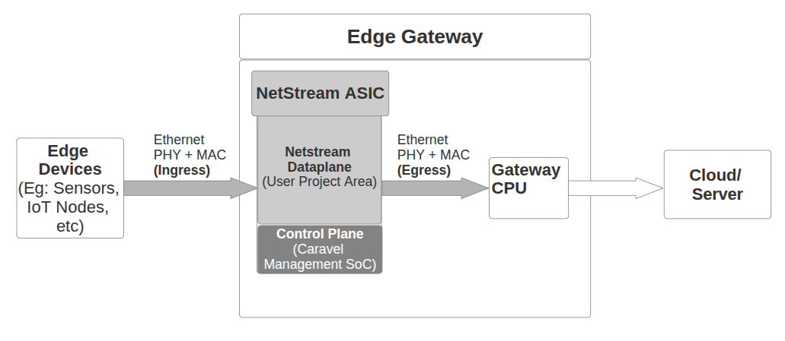

# NetStream: Caravel-Based Edge Network Packet-Processing Accelerator

## Overview

NetStream is a custom network packet-processing accelerator designed for edge IoT and industrial gateway applications, implemented within the Caravel SoC framework.

Modern edge devices are required to handle increasing volumes of network traffic while operating under strict latency, power, and cost constraints. Software-based packet processing on embedded processors often becomes a bottleneck, limiting real-time responsiveness and scalability in applications such as industrial monitoring, secure edge gateways, and smart infrastructure.

NetStream addresses this challenge by introducing a dedicated hardware offload engine for packet inspection, parsing, classification and action execution. By shifting these tasks from software to hardware, the system achieves lower latency, higher throughput, and reduced CPU load while maintaining efficiency under constrained power budgets.

The design is integrated with the Caravel management SoC, enabling programmable control and smooth system-level integration. NetStream is intended to operate as part of a complete edge networking system, interfacing with external Ethernet MAC and PHY components in a system-level deployment.

---

## Problem Statement

Edge devices and industrial gateways are increasingly required to perform real-time network functions such as packet filtering, traffic prioritization (QoS (Quality of Service)), and secure flow enforcement. These operations rely on rule-based processing, where each packet must be parsed, classified, and matched against large rule tables.

In conventional software-based implementations, these tasks are executed on general-purpose CPUs. However, packet processing workloads exhibit poor cache locality, irregular memory access patterns, and branch-heavy logic. As a result, frequent cache misses and memory accesses introduce latency, reduce throughput, and limit scalability under high traffic conditions.

These limitations are particularly critical in edge and industrial environments, where systems operate under strict latency, power, and cost constraints. As rule complexity and traffic volume grow, software-based approaches struggle to sustain performance, leading to:

- Reduced throughput for packet inspection and classification  
- Increased latency in time-sensitive applications  
- Higher power consumption due to CPU-intensive processing  
- Limited scalability with growing rule sets  

Existing hardware-accelerated solutions, such as SmartNICs and programmable switches, address some of these challenges but are primarily designed for data center environments. They often involve higher cost, increased power consumption, complex integration, and reliance on specialized toolchains, making them unsuitable for resource-constrained edge systems.

This creates a gap between high-performance networking solutions and the requirements of edge-scale deployments, which demand compact, cost-effective, and tightly integrated architectures capable of delivering deterministic, real-time packet processing.

---

## Proposed Solution

NetStream addresses the limitations of software-based packet processing by introducing a hardware-accelerated, streaming datapath integrated within the Caravel user project area.

The design follows a clear separation between control plane and data plane. The Caravel RISC-V management core acts as the control plane, responsible for configuring rules, updating policies, and monitoring system behavior. In contrast, the NetStream datapath operates as a dedicated data plane, performing packet parsing, classification, and action execution entirely in hardware.

Packets are processed through a deterministic, stage-wise pipeline where relevant fields are extracted, lookup keys are generated, and rule-based decisions are made in real time. This enables line-rate operation without relying on large memory accesses or complex software routines.

NetStream specifically offloads the computationally intensive classification stage from the gateway CPU. For example, in QoS scenarios, NetStream modifies packet metadata (e.g., DSCP fields) based on configured policies. The gateway CPU and networking stack then use these standard fields for scheduling and forwarding, without performing expensive rule lookups. This effectively separates packet processing into two stages: classification (expensive) in hardware (NetStream) and scheduling (cheap) in software (CPU).

By shifting classification from a software-driven, memory-bound workflow to a hardware-accelerated pipeline, NetStream reduces CPU load, improves throughput, and ensures deterministic latency, while remaining fully programmable through the Wishbone interface.

---

## System Architecture

NetStream is designed as a streaming hardware datapath integrated within the Caravel user project area, with a clear separation between the control plane (Caravel management SoC) and the data plane (Custom NetStream pipeline).

At a high level, packets enter the system from an external Ethernet PHY via a MAC interface, which presents packet data as a byte stream along with standard handshake signals (valid, ready, last).

### Packet Processing Pipeline

- **Ingress Interface & Buffering**  
   Incoming packet data is received through the MAC interface and buffered using an ingress FIFO to decouple I/O timing from internal processing.

- **Header Extraction & Parsing**  
   The packet stream is fed into a header buffer, where the header bytes are buffered before being forwarded to the parser FSM that extracts relevant header fields (e.g., protocol, addresses, ports) and formats them into structured metadata.

- **Key Generation**  
   A key builder module constructs a lookup key from the extracted metadata, which is used for rule matching.

- **TCAM-based Rule Matching Engine**  
   The generated key is matched against a programmable rule table (TCAM memory-based rule matching is done) , enabling fast, parallel classification of packets based on pre-defined policies.

- **Action Engine**  
   Based on the matched rule, an action is selected from an action memory. Eamples of supported actions include forwarding, dropping, tagging, or modifying packet metadata.

- **Packet Buffering & Action Application**  
   In parallel with header processing, the full packet is being stored in a data FIFO. Once the corresponding action decision is available, the packet stored is forwarded from the FIFO to an action multiplexer which applies the selected operation to the buffered packet.

- **Egress Path**  
   The processed packet is transmitted through the egress interface back to the MAC and subsequently to the external PHY.

### Key Architectural Characteristics

- **Streaming, Line-Rate Processing:**  
  Packets are processed in a pipelined manner without stalling on memory accesses.

- **Deterministic Latency:**  
  Fixed processing stages ensure predictable timing, critical for industrial applications. Since the packet is forwarded for the action as soona as the action arrives, the latency does not depend on the packet length, and has been calculated to be ~220 clock cycles in the worst case.

- **Decoupled Data and Control Planes:**  
  The datapath operates independently of the control logic, enabling efficient hardware acceleration. The control plane doesn't touch the packets in real-time, all the packet-processing is offloaded to the hardware.

- **Programmable Behavior:**  
  Rule tables and actions can be dynamically configured without modifying the hardware pipeline.
---

## Integration with Caravel

NetStream is implemented within the Caravel user project area and interfaces with the Caravel management SoC through the Wishbone bus.

### Control Plane Integration

The Caravel management SoC, which includes a RISC-V processor, serves as the control plane for NetStream. It is responsible for:

- Configuring TCAM rule tables for packet classification  
- Updating action memory entries  
- Monitoring flow statistics
- Managing system-level control and debugging  

All configuration and control operations are performed via memory-mapped registers exposed through a Wishbone slave interface implemented in the NetStream design.

### I/O Integration

- Packet I/O is interfaced through GPIO or dedicated user I/O pins connected to an external Ethernet MAC/PHY.  
- The design is integrated into the `user_project_wrapper`, adhering to Caravel’s standard interface requirements.

### System-Level Role

Within the overall system, Caravel provides programmability and system control, while NetStream functions as a dedicated hardware accelerator for packet processing. This separation enables efficient and scalable edge networking solutions.

---

## Block Diagram Of Architecture

---

## Current Progress

The design has been developed iteratively from a basic single-packet pipeline to a multi-packet, pipelined packet processing system.

- The dataplane RTL has been designed, integrated, and verified across multiple stages including parsing, key generation, TCAM matching, and action execution. It supports continuous packet flows with multiple packets in-flight through pipelining. - A packet buffering system (FIFO + rewrite path) has been integrated to enable correct synchronization between packet data and computed actions, allowing end-to-end packet handling.   
- Initial verification has been performed using testbenches covering multiple packet scenarios and action correctness.  
- The design has also been validated though a prototype on Kria KR260 FPGA, with successful synthesis, implementation, and bitstream generation.

Overall, a functional first iteration of the complete system has been realized, with both dataplane and control plane working together at a basic level.

---

## Problems Faced

- Synchronization across parallel datapaths was a major challenge, especially ensuring correct mapping of actions to packets in continuous flows.  
- Handling valid-ready handshakes and packet boundaries across modules led to multiple bugs and required redesigns.  
- Clock domain crossing and MAC interfacing introduced timing and alignment challenges with real packet streams.   
- Early designs suffered from long combinational paths, requiring architectural changes and deeper pipelining.  
- FPGA validation exposed additional issues not seen in simulation, particularly related to real-time behavior for multiple packets, in response to which the FIFO was modified to start draining the packets as soon as action arrives, and not wait for the entire packet to arrive.

---

## Future Work

- Improve pipelining across critical modules (especially TCAM and priority encoding) for higher frequency operation.
- Explore more varieties of actions to be taken on packets.
- Expand verification coverage to include edge cases and sustained high-throughput scenarios.  
- Integration of the control plane, that is the Caravel RISC-V Processor with the hardware accelerator, for programmability of TCAM and Action memories.
- Refine the ASIC flow (OpenLane) with proper constraints, timing closure, and design-space exploration.

---

## Verification and Backend Plan

The present version of the NetStream datapath has been implemented in Verilog and functionally verified using custom testbenches. This first iteration establishes the core packet-processing pipeline and validates the fundamental data flow end to end through the dataplane.

### RTL Verification

- Functional verification performed using Verilog testbenches 
- Initial end-to-end validation of the packet-processing pipeline, including:
  - Header parsing and metadata extraction  
  - Key generation and rule matching for a limited set of rules  
  - Action selection and packet forwarding/dropping/rewriting
  - Basic flow counting functionality  

- Test scenarios include:
  - Valid packet streams with known rule matches  
  - No-match conditions and default actions  
  - Basic handshake behavior using valid/ready signaling  

### Current Status

The current verification covers core functionality and demonstrates correct operation of the pipeline for representative cases. Further work will expand coverage to include:
- Larger and more complex rule sets  
- Corner cases and stress conditions  
- Robust backpressure and boundary scenarios  

### Waveform Validation

Simulation waveforms have been used to verify:
- Correct propagation of packet data across pipeline stages  
- Synchronization between packet buffering and action resolution  
- Timing of control signals (valid, ready, last)  

### Packet Processing and Action Application

### Gate-Level and Timing Verification

- Gate-Level Simulation (GLS) will be performed after synthesis  
- Static Timing Analysis (STA) will be conducted using OpenSTA as part of the OpenLane flow  

### Physical Design Flow

- Target process: SKY130 (130nm)  
- RTL-to-GDSII implementation using OpenLane  
- Includes synthesis, floorplanning, placement, routing, and timing verification

---

## Deliverables

The final submission will provide a complete, reproducible reference design spanning silicon, system integration, and documentation.

- **GDSII Layout:**  
  Tapeout-ready layout generated using OpenLane (SKY130)

- **RTL Source Code:**  
  Verilog implementation of the NetStream datapath, including both the initial working prototype and refined versions  

- **Verification Suite:**  
  Testbenches for RTL and Gate-Level Simulation (GLS), along with representative waveform results demonstrating pipeline operation  

- **PCBA Design**

- **Firmware**  

The project aims to deliver not just a functional chip, but an edge networking system thaat is reproduceable and can be scaled.

---

## Target Applications

- **Industrial Secure Gateway** :
NetStream enables deterministic, low-latency filtering of industrial network traffic by enforcing strict rule-based communication policies at the gateway level.

- **Traffic Prioritization (QoS)** : 
The design supports real-time classification and prioritization of packets, ensuring that critical control data is transmitted with minimal delay.

- **Edge IoT Data Filtering** :
NetStream reduces bandwidth and processing overhead by filtering and processing IoT traffic locally before transmission to the cloud.

- **Hardware Firewall** :
The match-action pipeline enables efficient rule-based packet filtering for secure edge deployments.

---

##  Feasibility

- Fits within Caravel user area (~10 mm² constraint)
- Modular design allows scaling
- Uses open-source toolchain (OpenLane, SKY130)

---

##  Timeline

- Proposal Submission: March 25
- RTL + Verification: April
- Tapeout Submission: April 30

---

##  License

Apache 2.0 

---

##  Author

Adhitya Santhanam

---

##  Repository Structure

(Will follow Caravel user project template)
