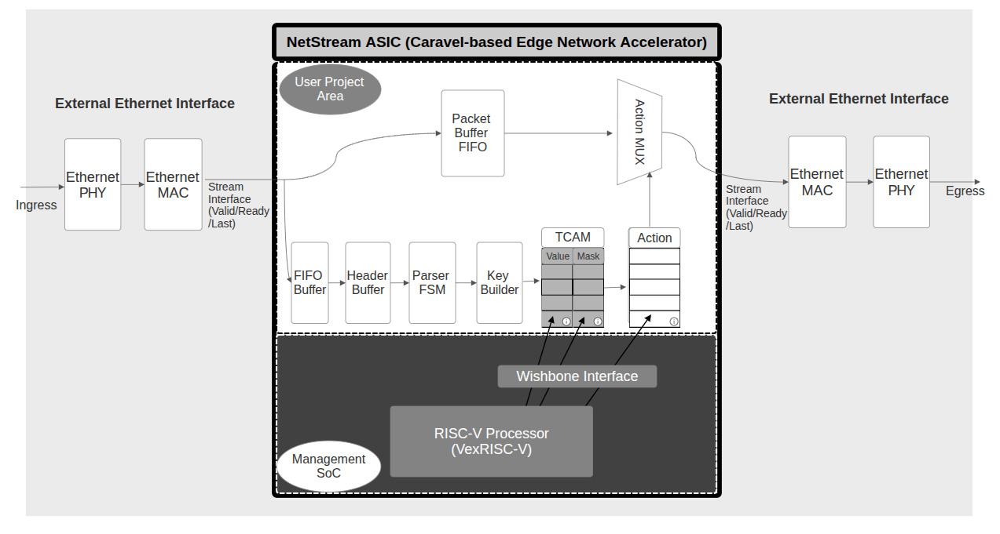
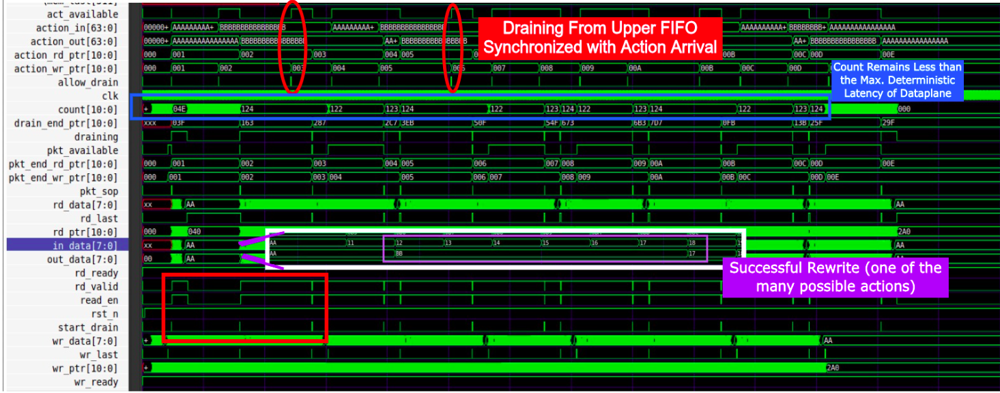

# NetStream: Caravel-Based Edge Network Packet-Processing Accelerator

##  Overview

NetStream is a custom network packet-processing accelerator designed for edge IoT and industrial gateway applications, implemented within the Caravel SoC framework.

Edge devices today need to handle increasing volumes of network traffic while operating under tight latency, power, and cost constraints. Software-based packet processing on embedded processors often becomes a bottleneck, limiting real-time responsiveness and scalability in applications such as industrial monitoring, secure edge gateways, and smart infrastructure.

NetStream has been designed to addresses this challenge by introducing a dedicated hardware offload engine that accelerates packet inspection, classification, and action handling. By moving these tasks from software into hardware, the system achieves lower latency, higher throughput, and reduced CPU load under low-power constraints for edge devices.

The design is integrated with the Caravel management SoC, allowing programmable control and system-level integration. NetStream is intended to function as part of a complete edge networking system, interfacing with external Ethernet MAC and PHY components as part of a system-level PCB implementation.

---

## Problem Statement

Modern edge devices and industrial gateways are increasingly required to perform real-time network functions such as packet filtering, traffic prioritization (QoS), and secure flow enforcement. These operations rely on rule-based processing, where each incoming packet must be parsed, classified, and matched against large rule tables.

In conventional software-based implementations, these tasks are executed on general-purpose CPUs. However, packet processing workloads exhibit poor cache locality and irregular memory access patterns, especially when dealing with large rule sets for firewalling, QoS policies, and flow management. As a result, frequent cache misses and memory accesses introduce significant latency and reduce throughput.

Additionally, packet processing involves branch-heavy logic and per-packet decision making, which further limits CPU efficiency and scalability under high traffic conditions. In edge and industrial environments, where devices operate under strict power, cost, and real-time constraints, these inefficiencies become critical bottlenecks.

This leads to several challenges:
- Inability to sustain high-throughput packet inspection and classification
- Increased latency in time-sensitive applications such as industrial control systems
- Higher power consumption due to CPU-intensive processing
- Limited scalability as rule complexity and traffic volume grow

As edge systems demand faster, more deterministic, and energy-efficient networking capabilities, relying solely on software-based packet processing is no longer sufficient.

---

## Proposed Solution

NetStream addresses the limitations of software-based packet processing by introducing a hardware-accelerated, streaming packet-processing pipeline integrated within the Caravel user project area.

The core design philosophy is based on a clear separation between the control plane and the data plane. The Caravel RISC-V management core acts as the control plane, responsible for configuring rules and actions, updating policies, and monitoring system behavior. In contrast, the NetStream datapath operates as a dedicated data plane, performing packet parsing, classification, and action execution entirely in hardware.

By structuring the design as a streaming pipeline, NetStream processes packets in a deterministic, stage-by-stage manner without relying on large memory accesses or complex software routines. Each packet flows through a sequence of hardware stages that extract relevant fields, generate lookup keys, match against rule sets parallely, and apply corresponding actions such as dropping, rewriting or forwarding.

This approach eliminates the cache inefficiencies and memory bottlenecks associated with CPU-based processing, enabling line-rate performance with deterministic latency and significantly reduced CPU overhead.

The system is fully programmable by the RISCV processor through the Wishbone interface, allowing dynamic updates to filtering rules, classification policies, and monitoring parameters without modifying the hardware datapath.

Overall, NetStream transforms packet processing from a software-driven, memory-bound workload into a hardware-accelerated, deterministic process suitable for edge and industrial networking environments.

---

## System Architecture

NetStream is designed as a streaming hardware datapath integrated within the Caravel user project area, with a clear separation between the control plane (Caravel management SoC) and the data plane (Custom NetStream pipeline).

At a high level, packets enter the system from an external Ethernet PHY via a MAC interface, which presents packet data as a byte stream along with standard handshake signals (valid, ready, last).

### Packet Processing Pipeline

- **Ingress Interface & Buffering**  
   Incoming packet data is received through the MAC interface and buffered using an ingress FIFO to decouple I/O timing from internal processing.

- **Header Extraction & Parsing**  
   The packet stream is fed into a parser FSM that extracts relevant header fields (e.g., protocol, addresses, ports) and formats them into structured metadata.

- **Key Generation**  
   A key builder module constructs a lookup key from the extracted metadata, which is used for rule matching.

- **Rule Matching Engine**  
   The generated key is matched against a programmable rule table (TCAM-based rule maatching is done) , enabling fast, parallel classification of packets based on pre-defined policies.

- **Action Engine**  
   Based on the matched rule, an action is selected from an action memory. Eamples of supported actions include forwarding, dropping, tagging, or modifying packet metadata.

- **Packet Buffering & Action Application**  
   In parallel with header processing, the full packet is being stored in a data FIFO. Once the corresponding action decision is available, the packet stored is forwarded from the FIFO to an action multiplexer which applies the selected operation to the buffered packet.

- **Egress Path**  
   The processed packet is transmitted through the egress interface back to the MAC and subsequently to the external PHY.

### Key Architectural Characteristics

- **Streaming, Line-Rate Processing:**  
  Packets are processed in a pipelined manner without stalling on memory accesses.

- **Deterministic Latency:**  
  Fixed processing stages ensure predictable timing, critical for industrial applications. Since the packet is forwarded for the action as soona as the action arrives, the latency does not depend on the packet length, and has been calculated to be ~220 clock cycles in the worst case.

- **Decoupled Data and Control Planes:**  
  The datapath operates independently of the control logic, enabling efficient hardware acceleration. The control plane doesn't touch the packets in real-time, all the packet-processing is offloaded to the hardware.

- **Programmable Behavior:**  
  Rule tables and actions can be dynamically configured without modifying the hardware pipeline.
---

## Integration with Caravel

NetStream is implemented within the Caravel user project area and interfaces with the Caravel management SoC through the Wishbone bus.

### Control Plane Integration

The Caravel management SoC, which includes a RISC-V processor, serves as the control plane for NetStream. It is responsible for:

- Configuring TCAM rule tables for packet classification  
- Updating action memory entries  
- Monitoring flow statistics
- Managing system-level control and debugging  

All configuration and control operations are performed via memory-mapped registers exposed through a Wishbone slave interface implemented in the NetStream design.

### Data Plane Independence

The NetStream datapath operates independently of the Caravel CPU, ensuring that packet processing continues at line rate without CPU intervention. The CPU is only involved in control and configuration, not in per-packet processing.

### I/O Integration

- Packet I/O is interfaced through GPIO or dedicated user I/O pins connected to an external Ethernet MAC/PHY.  
- The design is integrated into the `user_project_wrapper`, adhering to Caravel’s standard interface requirements.

### System-Level Role

Within the overall system, Caravel provides programmability and system control, while NetStream functions as a dedicated hardware accelerator for packet processing. This separation enables efficient and scalable edge networking solutions.

---

## Block Diagram Of Architecture

---

## Verification Plan

An initial version of the NetStream datapath has been implemented in Verilog and functionally verified using custom testbenches. This first iteration establishes the core packet-processing pipeline and validates the fundamental data flow and control mechanisms.

### RTL Verification

- Functional verification performed using Verilog testbenches and cocotb-based simulations  
- Initial end-to-end validation of the packet-processing pipeline, including:
  - Header parsing and metadata extraction  
  - Key generation and rule matching for a limited set of rules  
  - Action selection and packet forwarding/dropping/rewriting
  - Basic flow counting functionality  

- Test scenarios include:
  - Valid packet streams with known rule matches  
  - No-match conditions and default actions  
  - Basic handshake behavior using valid/ready signaling  

### Current Status

The current verification covers core functionality and demonstrates correct operation of the pipeline for representative cases. Further work will expand coverage to include:
- Larger and more complex rule sets  
- Corner cases and stress conditions  
- Robust backpressure and boundary scenarios  

### Waveform Validation

Simulation waveforms have been used to verify:
- Correct propagation of packet data across pipeline stages  
- Synchronization between packet buffering and action resolution  
- Timing of control signals (valid, ready, last)  

### Packet Processing and Action Application

### Gate-Level and Timing Verification

- Gate-Level Simulation (GLS) will be performed after synthesis  
- Static Timing Analysis (STA) will be conducted using OpenSTA as part of the OpenLane flow  

This staged verification approach ensures a smooth transition from functional validation to silicon-ready design.

---

## Implementation Plan

NetStream is being developed iteratively, starting from a functional RTL prototype and progressing toward a fully optimized and fabrication-ready design.

### RTL Design

- Initial Verilog implementation of the packet-processing pipeline completed  
- Modular structure covering parser, rule matching, action engine, and control interface  
- Current design focuses on functional correctness and architectural validation  

- Ongoing improvements include:
  - Pipeline optimization for higher throughput  
  - Refinement of rule matching structures  
  - Enhanced buffering and flow control mechanisms  

### Verification

- Functional verification using Verilog testbenches and cocotb  
- Simulation with Verilator for rapid iteration and debugging  
- Gradual expansion of test coverage and complexity  

### Physical Design Flow

- Target process: SKY130 (130nm)  
- RTL-to-GDSII implementation using OpenLane  
- Includes synthesis, floorplanning, placement, routing, and timing verification  

### System Integration

- Integration into Caravel `user_project_wrapper`  
- Wishbone-based control interface for rule configuration and monitoring  
- External interfacing with Ethernet MAC/PHY as part of PCB-level system  

This phased implementation approach ensures that the design evolves from a working prototype into a robust and optimized silicon solution.

## Deliverables

The final submission will provide a complete, reproducible reference design spanning silicon, system integration, and documentation.

- **GDSII Layout:**  
  Tapeout-ready layout generated using OpenLane (SKY130)

- **RTL Source Code:**  
  Verilog implementation of the NetStream datapath, including both the initial working prototype and refined versions  

- **Verification Suite:**  
  Testbenches for RTL and Gate-Level Simulation (GLS), along with representative waveform results demonstrating pipeline operation  

- **PCBA Design:**

- **Firmware:**  
  Software for rule configuration, control, and monitoring via the Caravel management SoC  

- **Documentation:**  
  Detailed design documentation covering architecture, integration, and usage  

- **Demonstration:**  
  A system-level demonstration showcasing packet processing use-cases and real-time operation  

The project aims to deliver not just a functional chip, but a complete and reproducible edge networking reference design.

---

## Target Applications

- **Industrial Secure Gateway** :
NetStream enables deterministic, low-latency filtering of industrial network traffic by enforcing strict rule-based communication policies at the gateway level.

- **Traffic Prioritization (QoS)** : 
The design supports real-time classification and prioritization of packets, ensuring that critical control data is transmitted with minimal delay.

- **Edge IoT Data Filtering** :
NetStream reduces bandwidth and processing overhead by filtering and processing IoT traffic locally before transmission to the cloud.

- **Hardware Firewall** :
The match-action pipeline enables efficient rule-based packet filtering for secure edge deployments.

---

##  Feasibility

- Fits within Caravel user area (~10 mm² constraint)
- Modular design allows scaling
- Uses open-source toolchain (OpenLane, SKY130)

---

##  Timeline

- Proposal Submission: March 25
- RTL + Verification: April
- Tapeout Submission: April 30

---

##  License

Apache 2.0 

---

##  Author

Adhitya Santhanam

---

##  Repository Structure

(Will follow Caravel user project template)
