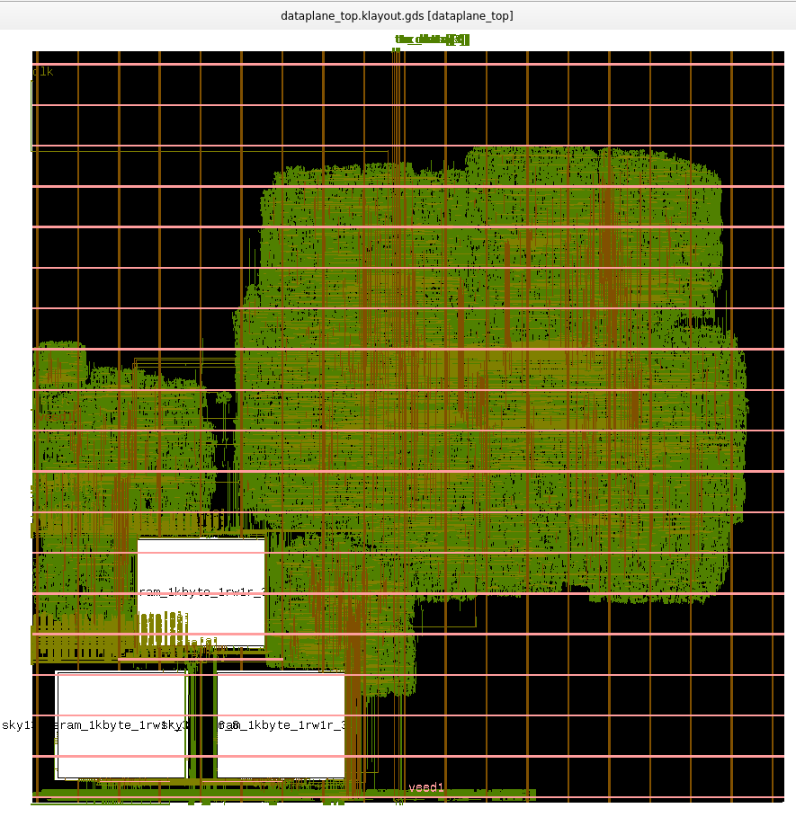

# NetStream: Caravel-Based Edge Network Packet-Processing Accelerator

## Overview

NetStream is a hardware-accelerated network packet-processing engine designed for edge IoT and industrial gateway applications, implemented within the Caravel SoC framework.

Modern edge and industrial systems increasingly require real-time network functions such as:
- Packet filtering  
- QoS (Quality of Service) enforcement  
- Traffic classification  
- Secure flow management  

These systems operate under strict:
- Latency constraints  
- Power constraints  
- Cost constraints  

In conventional software-based implementations, these tasks are executed on general-purpose CPUs, where packet-processing workloads suffer from irregular memory accesses, poor cache locality, and branch-heavy control flow. As traffic volume and rule complexity increase, software approaches struggle to sustain throughput and deterministic response times, leading to higher latency, increased CPU utilization, and limited scalability.

NetStream addresses these limitations by offloading packet parsing, classification, and action execution into a dedicated streaming hardware datapath. The architecture combines programmable TCAM-based rule matching, pipelined packet processing, and hardware action execution to enable low-latency, high-throughput packet handling with reduced CPU involvement.

The design follows a clear separation between control plane and data plane. The Caravel management SoC acts as the programmable control plane responsible for rule configuration and system management, while the NetStream datapath performs real-time packet inspection and processing entirely in hardware.

Unlike traditional hardware-accelerated networking solutions such as SmartNICs and programmable switches, which are typically optimized for data center environments, often involving higher cost, increased power consumption, complex integration, and reliance on specialized toolchains. NetStream targets compact and resource-constrained edge deployments. The system is designed to integrate with external Ethernet MAC and PHY components and operate as part of a complete edge networking platform, providing deterministic packet processing in a cost-effective, power-efficient and scalable architecture.

---

## Current Status

| Component | Status |
|---|---|
| RTL datapath implementation | Completed |
| DFFRAM macro integration for TCAM and action memories | Completed |
| Multi-packet dataplane verification | Completed |
| FPGA validation on Kria KR260 | Completed |
| OpenLane RTL-to-GDSII flow for dataplane | Completed |
| Caravel management SoC integration with dataplane | Completed |
| Verification of register writes from Caravel CPU to TCAM and action memories using Cocotb and custom firmware | Completed |
| Hardening of `user_project_wrapper` with dataplane macro | Completed |
| Caravel precheck | In Progress (10/13 PASS) |
| PCBA Integration | In Progress |
---

## System Architecture

NetStream is a hardware-accelerated streaming packet-processing engine integrated within the Caravel user project area. The architecture follows a clear separation between the control plane and data plane:

- The Caravel RISC-V management core acts as the control plane, responsible for:
  - Rule configuration  
  - Action memory updates  
  - Policy management  
  - System monitoring and debugging  

- The NetStream datapath operates as the data plane, performing:
  - Packet parsing  
  - Header extraction  
  - Packet classification  
  - Action execution  

Packet processing is fully offloaded to hardware, reducing CPU involvement and enabling deterministic low-latency operation.
At a high level, packets enter the system from an external Ethernet PHY through a MAC interface that presents packet data as a byte stream along with standard handshake signals (`valid`, `ready`, `last`).

---

### Packet Processing Pipeline

- **Ingress Interface & Buffering**  
   Incoming packet data is received through the MAC interface and buffered using an ingress FIFO to decouple I/O timing from internal processing.

- **Header Extraction & Parsing**  
   The packet stream is fed into a header buffer, where the header bytes are buffered before being forwarded to the parser FSM that extracts relevant header fields (e.g., protocol, addresses, ports) and formats them into structured metadata.

- **Key Generation**  
   A key builder module constructs a lookup key from the extracted metadata, which is used for rule matching.

- **TCAM-based Rule Matching Engine**  
   The generated key is matched against a programmable rule table (TCAM memory-based rule matching is done) , enabling fast, parallel classification of packets based on pre-defined policies.

- **Action Engine**  
   Based on the matched rule, an action is selected from an action memory. Eamples of supported actions include forwarding, dropping, tagging, or modifying packet metadata.

- **Packet Buffering & Action Application**  
   In parallel with header processing, the full packet is being stored in a data FIFO. Once the corresponding action decision is available, the packet stored is forwarded from the FIFO to an action multiplexer which applies the selected operation to the buffered packet.

- **Egress Path**  
   The processed packet is transmitted through the egress interface back to the MAC and subsequently to the external PHY.

---

### Key Architectural Characteristics

- **Throughput and Bandwidth**
| Parameter | Value |
|---|---|
| Data width | 8 bits (1 byte/cycle) |
| Clock period | 25 ns (Can be decreased upto 14 ns) |
| Operating frequency | 40 MHz |
| Peak throughput | ~320 Mbps |
| Processing style | Fully pipelined |

- **I/O Constraints (Caravel Platform)**
Packet I/O is mapped through Caravel user I/O pins   
Current design uses serialized 8-bit streaming interface  
As a result, throughput is limited by I/O bandwidth rather than internal pipeline capability.

- **External Interface Assumptions**
NetStream interfaces with an external Ethernet MAC and PHY in a PCB-level deployment.
Due to the limited GPIO bandwidth available on the Caravel platform, the ASIC does not directly implement a full Ethernet MAC interface. Instead, NetStream exposes a lightweight streaming datapath interface consisting of:
- `data[7:0]`
- `valid`
- `ready`
- `last`
An external RMII/MII-compatible lightweight Ethernet MAC is used to connect the Ethernet PHY to the NetStream datapath.
System integration is as follows:
Ethernet PHY ↔ RMII/MII MAC ↔ NetStream ASIC ↔ Host Controller

- **Deterministic Latency:**
| Parameter | Value |
|---|---|
| Pipeline depth (worst case) | ~246 cycles |
| Clock period | 25 ns |
| Operating frequency | 40 MHz |
| Worst-case latency | ~6.15 µs |
The latency is deterministic and largely independent of packet length due to the streaming pipeline architecture and early action resolution mechanism.

- **Custom DFFRAM-Based Memory Architecture**
The TCAM and action memories were implemented using custom-generated 32×32 DFFRAM macros instead of larger pre-generated SRAM configurations.
Smaller custom DFFRAM blocks were selected to better match the storage requirements of the dataplane while remaining within the area constraints of the Caravel user project area.
The design currently uses:
- 8 DFFRAM macros for TCAM storage  
- 4 DFFRAM macros for action memory storage  
This modular memory organization enabled:
- Improved area efficiency  
- Better floorplanning flexibility  
- Reduced routing complexity  
- Easier timing optimization through pipelined lookup stages  
The transition from an earlier combinational lookup architecture to a pipelined DFFRAM-based implementation significantly improved timing performance and enabled successful timing closure under nominal conditions.

### System Summary

| Parameter | Value |
|---|---|
| Control plane | Caravel RISC-V management SoC |
| Data plane | Fully pipelined NetStream datapath |
| Processing pipeline depth | ~246 cycles |
| Data width | 8 bits (1 byte/cycle) |
| Clock period | 25 ns |
| Operating frequency | 40 MHz |
| Peak throughput | ~320 Mbps |
| Worst-case latency | ~6.15 µs |
| Packet interface | Streaming byte interface (`data`, `valid`, `ready`, `last`) |
| External connectivity | RMII/MII-compatible Ethernet MAC + PHY |
| Memory implementation | Custom 32×32 DFFRAM macros |
| TCAM memory organization | 8 DFFRAM macros |
| Action memory organization | 4 DFFRAM macros |
| Processing style | Fully pipelined streaming architecture |

---

### Integration with Caravel

NetStream is implemented within the Caravel user project area and interfaces with the Caravel management SoC through the Wishbone bus.

- **Control Plane Integration**

The Caravel management SoC, which includes a RISC-V processor, serves as the control plane for NetStream. It is responsible for:

Configuring TCAM rule tables for packet classification  
Updating action memory entries  
Monitoring flow statistics
Managing system-level control and debugging  

All configuration and control operations are performed via memory-mapped registers exposed through a Wishbone slave interface implemented in the NetStream design.

- **I/O Integration**

Packet I/O is interfaced through GPIO or dedicated user I/O pins connected to an external Ethernet MAC/PHY.  
The design is integrated into the `user_project_wrapper`, adhering to Caravel’s standard interface requirements.

- **System-Level Role**

Within the overall system, Caravel provides programmability and system control, while NetStream functions as a dedicated hardware accelerator for packet processing. This separation enables efficient and scalable edge networking solutions.

## Block Diagram Of Architecture

---

## Current Progress

The NetStream design has evolved from a functional RTL prototype into a physically implemented ASIC datapath through multiple OpenLane iterations.

### Dataplane Development

- Complete dataplane RTL implemented, including:
  - Packet parsing and metadata extraction  
  - Key generation and TCAM-based classification  
  - Action selection and packet rewrite path  

- Fully pipelined architecture supporting multiple packets in-flight  
- FIFO-based buffering added to ensure correct alignment between packet data and computed actions  

### FPGA Validation

- Design validated on Kria KR260 FPGA  
- Successful synthesis, implementation, and bitstream generation  
- Real-time packet behavior verified, leading to architectural improvements (early FIFO drain once action is ready)

### ASIC Implementation Progress

- Dataplane successfully taken through full RTL-to-GDSII flow (OpenLane, SKY130)  
- SRAM macros integrated for TCAM and action memory  

- The TCAM was redesigned from a purely combinational structure to a **pipelined SRAM-based lookup**, which significantly reduced critical path delay and enabled timing closure in nominal conditions  

- Post-route outputs generated: GDSII, DEF, LEF, SPEF, SDF, and LIB  

- Caravel integration:
  - `user_project_wrapper` integration completed and hardened for dataplane-only version  
  - Confirms compatibility with Caravel infrastructure  

### Timing Status (STA)

- **Nominal corner (TT, 1.8V, 25°C):**
  - No setup or hold violations  
  - Setup slack ≈ +1.78 ns  
  - Hold slack ≈ +0.11 ns  

- Timing closure at TT was achieved after introducing pipelining in the TCAM lookup stage using SRAM macros, replacing the earlier combinational implementation which had significant critical path violations  

- **Multi-corner timing (SS/FF):**
  - Full closure across extreme PVT corners is pending  
  - Current results indicate additional optimization is required for robustness under worst-case conditions  

---

## Problems Faced

### Timing and Signal Integrity

- Initial design (combinational TCAM) resulted in large critical paths and timing violations  
- Resolved by introducing pipelined SRAM-based lookup, but further optimization is needed for multi-corner closure  

- Max slew and capacitance violations observed, indicating need for:
  - Improved buffering  
  - Better cell sizing and fanout control  

### Antenna Violations

- Net violations: 73  
- Pin violations: 80  

- Caused by long routing segments and high fanout nets  
- Requires diode insertion and routing refinement  

### DRC and Toolchain Issues

- **KLayout DRC:** 0 violations (clean)  
- **Magic DRC:** High violation count (~4700)  

- Main cause:
  - OpenRAM macro integration  
  - Layer mapping / unsupported layer issues in Magic  

### Integration Challenges

- OpenRAM macro integration introduced:
  - GDS layer mismatches  
  - Tool compatibility issues with Magic  

- Required manual fixes and adjustments to layer handling  

### Architectural Challenges

- Synchronization across parallel datapaths required redesign of buffering strategy  
- Valid-ready handshake handling across modules led to multiple bugs  
- FPGA testing exposed real-time issues not visible in simulation  

---

## Future Work

### Multi-Corner Timing Closure

- Extend timing closure beyond TT corner by:
  - Further pipelining critical paths  
  - Optimizing TCAM and key generation stages  
  - Buffer insertion and logic restructuring  

### Signal Integrity Fixes

- Address max slew and capacitance violations  
- Optimize fanout and routing  

### Antenna Fixing

- Insert antenna diodes  
- Improve routing to reduce long wire segments  

### DRC Cleanup

- Resolve Magic DRC issues by:
  - Fixing OpenRAM layer mapping  
  - Aligning technology files and layer definitions  

### Full Caravel Integration

- Integrate macro-based dataplane into `user_project_wrapper`  
- Validate complete system including control plane and memory  

### Verification Expansion

- Add stress and long-duration packet testing  
- Increase rule table complexity  
- Perform Gate-Level Simulation (GLS) with SDF back-annotation

---

### Area Constraints and Physical Utilization

The NetStream datapath has been taken through a complete RTL-to-GDSII flow using OpenLane (SKY130), enabling accurate evaluation of area and utilization.

### Post-Layout Area Metrics

- **Die area:** ~8.07 mm²  
- **Core area:** ~7.98 mm²  
- **Standard cell area:** ~2.00 mm²  
- **Macro area (SRAM blocks):** ~0.57 mm²  
- **Total instance area:** ~2.57 mm²  

- **Utilization:**
  - Target density: 25%  
  - Achieved utilization: ~32%
 

### Observations

- The design comfortably fits within the Caravel user project area constraints.  

- The relatively low utilization indicates:
  - Headroom for further logic expansion or deeper pipelining  
  - Opportunity to improve timing closure by redistributing logic  

- Presence of SRAM macros (TCAM and action memory) contributes significantly to area realism compared to pure RTL estimates.  

### Physical Design Status

- Placement and routing completed successfully  
- Final routed design area is within acceptable limits for Caravel integration  

- Area efficiency can be further improved through:
  - Density tuning  
  - Floorplan optimization  
  - Macro placement refinement  

---

## Verification and Backend Plan and Progress

The present version of the NetStream datapath has been implemented in Verilog and functionally verified using custom testbenches. This first iteration establishes the core packet-processing pipeline and validates the fundamental data flow end to end through the dataplane. As for the backend, a few iterations of the Openlane flow have been tried on the intial Dataplane RTL, with a few issues still to be resolved.

### RTL Verification

- Functional verification performed using Verilog testbenches 
- Initial end-to-end validation of the packet-processing pipeline, including:
  - Header parsing and metadata extraction  
  - Key generation and rule matching for a limited set of rules  
  - Action selection and packet forwarding/dropping/rewriting
  - Basic flow counting functionality  

- Test scenarios include:
  - Valid packet streams with known rule matches  
  - No-match conditions and default actions  
  - Basic handshake behavior using valid/ready signaling  

### Current Status

The current verification covers core functionality and demonstrates correct operation of the pipeline for representative cases. Further work will expand coverage to include:
- Larger and more complex rule sets  
- Corner cases and stress conditions  
- Robust backpressure and boundary scenarios  

### Waveform Validation

Simulation waveforms have been used to verify:
- Correct propagation of packet data across pipeline stages  
- Synchronization between packet buffering and action resolution  
- Timing of control signals (valid, ready, last)  

### Packet Processing and Action Application

### Gate-Level and Timing Verification

- Gate-Level Simulation (GLS) will be performed after synthesis  
- Static Timing Analysis (STA) will be conducted using OpenSTA as part of the OpenLane flow

### Backend Verification

- Static Timing Analysis (STA) performed using OpenSTA  
- Timing closure achieved at nominal (TT) corner  
- Multi-corner timing verification (SS/FF) in progress  
- Gate-Level Simulation (GLS) with SDF back-annotation planned  

### Verification Criteria

The following conditions are used to determine correctness:

- Correct extraction of header fields from packet stream  
- Accurate key generation corresponding to input packet fields  
- Deterministic TCAM match behavior for programmed rules  
- Correct action selection and application to packet data  
- No data loss or corruption across pipeline stages  
- Proper valid/ready handshake behavior across modules  

### Verification Summary

| Feature | Description | Status |
|--------|------------|--------|
| Packet parsing | Header extraction and metadata generation | PASS |
| Key generation | Correct key formation from parsed fields | PASS |
| TCAM matching | Rule lookup and match detection | PASS |
| Action execution | Forward / drop / modify operations | PASS |
| Packet buffering | FIFO alignment with action resolution | PASS |
| Multi-packet pipeline | Multiple packets in-flight | PARTIAL (3-packets) |
| Backpressure handling | Valid/ready behavior under stalls | PASS |
| Corner cases | Malformed / edge packets | PARTIAL |

### Example Test Case

- Input: IPv4 packet with destination port = 80  
- Rule: Match on destination port = 80 → action = modify DSCP  
- Expected Behavior:
  - Packet matched in TCAM  
  - Action selected correctly  
  - DSCP field modified in output packet  

Observed result matches expected behavior as verified in waveform.

### Verification Limitations

- Current verification focuses on functional correctness for representative scenarios  
- Full coverage of corner cases and stress conditions is ongoing  
- Long-duration and high-throughput stress testing remains to be completed  

## Deliverables

The final submission will provide a complete, reproducible reference design spanning silicon, system integration, and documentation.

- **GDSII Layout:**  
  Tapeout-ready layout generated using OpenLane (SKY130)

- **RTL Source Code:**  
  Verilog implementation of the NetStream datapath, including both the initial working prototype and refined versions  

- **Verification Suite:**  
  Testbenches for RTL and Gate-Level Simulation (GLS), along with representative waveform results demonstrating pipeline operation  

- **PCBA Design**

- **Firmware**  

The project aims to deliver not just a functional chip, but an edge networking system thaat is reproduceable and can be scaled.

---

## Target Applications

### 1. Industrial Edge Gateway (Deterministic Filtering)

NetStream can be deployed within industrial gateways that connect field devices (PLCs, sensors) to higher-level networks.

- Role: Enforce strict communication policies (allow/deny rules) at line rate  
- Problem: Software-based filtering introduces latency and unpredictability  
- Benefit: Deterministic, low-latency packet classification independent of CPU load  

### 2. QoS Pre-Processing Engine (Traffic Classification)

NetStream performs early packet classification before packets reach the main networking stack.

- Role: Modify packet metadata (e.g., DSCP tagging) based on rules  
- Problem: CPU-based classification is expensive and scales poorly  
- Benefit: Offloads classification, allowing the OS/network stack to focus only on scheduling  

### 3. Lightweight Edge Firewall (Rule-Based Filtering)

NetStream acts as a hardware firewall in resource-constrained edge devices.

- Role: Drop or allow packets based on configurable rule tables  
- Problem: Traditional firewall processing consumes CPU and memory bandwidth  
- Benefit: High-throughput filtering with minimal CPU involvement  

### 4. IoT Data Filtering and Pre-Processing

Used in IoT gateways to reduce unnecessary upstream traffic.

- Role: Filter, tag, or modify packets before forwarding to cloud  
- Problem: Sending all data upstream increases bandwidth and processing cost  
- Benefit: Local processing reduces bandwidth usage and improves responsiveness  

### 5. Deterministic Policy Engine for Edge Networks

NetStream can function as a programmable match-action engine for enforcing network policies.

- Role: Apply rule-based actions with fixed latency  
- Problem: Software systems introduce variability in processing time  
- Benefit: Predictable latency (~2.2 µs) enables time-sensitive applications  

## System Feasibility and Bill of Materials (BOM)

NetStream is designed as a hardware accelerator within an edge networking system.  
**Tapeout and fabrication costs are excluded**, as they are covered separately (e.g., MPW programs) and do not reflect deployment cost.

### Hardware Components

| Component | Description | Example | Cost (USD) |
|----------|------------|--------|-----------|
| NetStream ASIC (Caravel-based) | Packet processing accelerator | Fabricated chip (MPW) | Excluded |
| Ethernet PHY | Physical layer interface | LAN8720, DP83848 | 2 – 5 |
| Ethernet MAC | Frame interface (MII/RMII/GMII) | External MAC / soft MAC | 0 – 5 |
| Host Controller | Control plane + configuration | STM32 / RP2040 / Raspberry Pi | 3 – 15 |
| Power + PCB | Regulators, connectors, board | — | 8 – 20 |

---

### Estimated System Cost (Excluding ASIC Fabrication)

- **Low-cost configuration (MCU-based):** ~$15 – $30  
- **Enhanced configuration (Linux-capable host):** ~$25 – $45  

---

### Notes on Cost Assumptions

- Ethernet PHY pricing is based on commonly available 10/100 Mbps parts in low-volume quantities  
- Ethernet MAC functionality may be:
  - Integrated within the host (common in MCUs/SoCs), or  
  - Implemented as a lightweight external/FPGA soft MAC  
- Host controller cost varies depending on required software stack (bare-metal vs Linux)  
- PCB cost assumes simple 2–4 layer board typical for edge devices  

---

### Deployment Model

NetStream operates as a hardware accelerator within an edge gateway:

- PHY handles physical signaling  
- MAC converts Ethernet frames into a byte-stream interface  
- NetStream performs packet classification and action execution  
- Host CPU manages control plane and networking stack  

This modular architecture enables cost-effective deployment while maintaining flexibility and scalability.

---

##  Timeline

- Proposal Submission: March 25
- RTL + Verification: April
- Tapeout Submission: April 30

---

##  License

Apache 2.0 

---

##  Author

Adhitya Santhanam

---

##  Repository Structure

(Will follow Caravel user project template)
