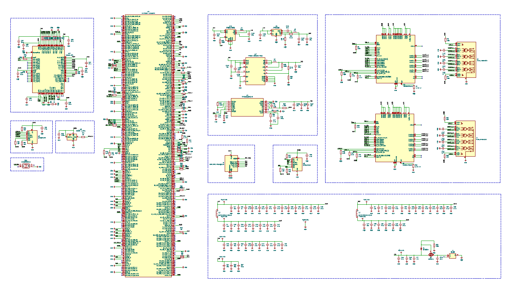

# PCB Integration (KiCAD)

To demonstrate deployment feasibility beyond standalone ASIC implementation, a system-level PCB integration architecture was developed for NetStream. It is being implemented on KiCAD.

Gerber and Schematic File can be found in this directory

## KiCAD Schematic

