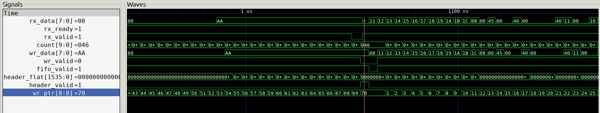
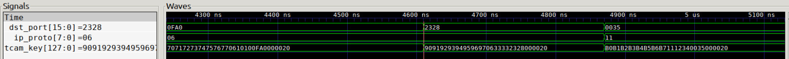
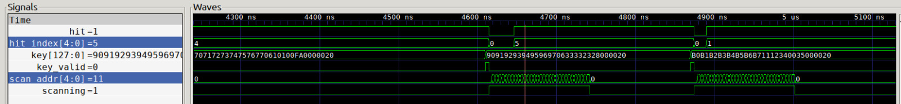
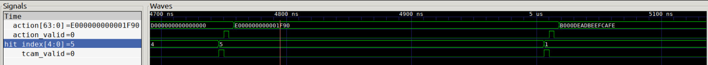
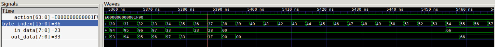
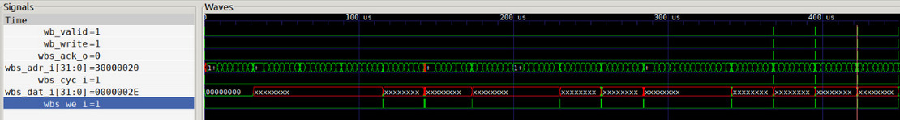
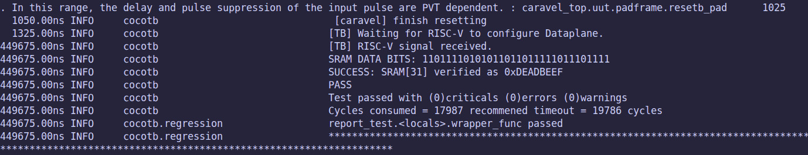
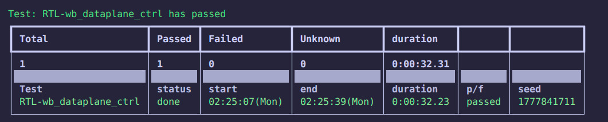

<!---
# SPDX-FileCopyrightText: 2020 Efabless Corporation
#
# Licensed under the Apache License, Version 2.0 (the "License");
# you may not use this file except in compliance with the License.
# You may obtain a copy of the License at
#
#      http://www.apache.org/licenses/LICENSE-2.0
#
# Unless required by applicable law or agreed to in writing, software
# distributed under the License is distributed on an "AS IS" BASIS,
# WITHOUT WARRANTIES OR CONDITIONS OF ANY KIND, either express or implied.
# See the License for the specific language governing permissions and
# limitations under the License.
#
# SPDX-License-Identifier: Apache-2.0
-->

# NetStream Dataplane Block-Level Verification Report

This document desctribes the functional, block-level verification of the NetStream Dataplane pipeline. Before connecting the datapath to the Caravel Management SoC and the Wishbone bus, we isolated the core networking logic and tested it using a custom Verilog testbench (`tb_final.v`). 

The sections below track how test packets flow through the Dataplane pipeline, and supporting waveform screenshots.

---

## 1. Data Input and Split Buffering (`mac_rx_fifo_final`, `packet_fifo_upper`, & `header_buffer_pipe_fifo`)

**Objective:** Check that incoming Ethernet packets are received smoothly and split into two paths, one for the payload and one for the headers without dropping data or slowing down.

**Architecture Summary:**
Incoming network traffic arrives at the `rx` interface. Here, the design splits into two paths:
* **The Payload Path:** The raw packet bytes go into `packet_fifo_upper`. This is a  buffer that holds the packet data while the downstream TCAM makes a decision.
* **The Header Path:** At the same time, the data goes into a smaller temporary buffer (`mac_rx_fifo_final`) which passes it to the `header_buffer_pipe_fifo`. This module extracts the header of the packet.

If a packet finishes before hitting the 192-byte limit, the Header Buffer immediately sends a `hdr_valid` signal to activate the Parser instead of waiting to fill up.

**Waveform Verification:**

**Analysis:**
The waveform shows the MAC interface accepting the bytes without pausing (`rx_ready` stays high ). 
	-  **Payload Buffer:** The `count` variable goes up to 70 (Hex `046`), proving the `packet_fifo_upper` successfully caught all the payload bytes.
	- **Header Extraction:** At that moment, the Header Buffer collects the header data. The write pointer (`wr_ptr`) hits 70 as the packet ends. It immediately asserts the `hdr_valid` signal to pass the `hdr_flat` data to the Parser. 

## 2. Key Generation (`key_builder_pipe`)

**Objective:** Verify that the separate pieces of extracted data from the Parser are correctly combined into a single 128-bit search key.

**Architecture Summary:**
The TCAM memory cannot read separate wires for IP addresses and ports; it needs one well formatted 128-bit string to do a search. The Key Builder is a purely combinational block. It takes the extracted data from the Parser, adds zeros to the unused spaces, and packs them side-by-side into a strict format called the `tcam_key`. 

**Waveform Verification:**

**Analysis:**
Using the Service Remap test packet (Test 6), the waveform shows the Key Builder doing its formatting job. The Parser extracts the Destination Port as `2328` (Hex for 9000) and the Protocol as `06` (TCP). Instantly, the Key Builder stitches these fields into the 128-bit `tcam_key`. One can see the `06` and `2328` aligned in their correct bit-positions within the massive output string, proving the key is properly formatted for the TCAM.

---

## 3. TCAM Rule Matching (`tcam_ctrl_pipe`)

**Objective:** Prove that the Dataplane can take the 128-bit key, search the rule memory, and successfully find the correct match index.

**Architecture Summary:**
This block uses standard `RAM32` SRAM macros and a scanning state machine to simulate TCAM behavior. When a valid key arrives, the controller enters a "scanning" state. It steps through the memory addresses, masking and comparing the stored rules against the search key. When it finds a match, it stops, outputs a `hit` signal, and passes along the matching rule number (`hit_index`).

**Waveform Verification:**

**Analysis:**
The waveform tracks the TCAM controller processing the key for Test 6. When `key_valid` goes high, the `scanning` signal activates and the `scan_addr` begins counting up from 0 to check the memory. A few clock cycles later, the logic finds a match. The `hit` signal successfully goes high, and the `hit_index` outputs `5` (confirming it matched our programmed Service Remap rule at index 5). The scanner then finishes its cycle and prepares to pass this index to the Action pipeline.

## 4. Action Lookup (`action_pipe`)

**Objective:** Check that the matching rule number from the TCAM correctly grabs the right execution instruction from memory.

**Architecture Summary:**
Once the TCAM finds a match, the system needs to know what to do with the packet (e.g., drop it, forward it, or change a header). The Action Pipe uses the `hit_index` as an address to look up the instruction stored in standard SRAM blocks. This 64-bit instruction contains a code telling the MUX what type of rewrite to do, along with the new data values.

**Waveform Verification:**

**Analysis:**
Using the Service Remap test packet (Test 6), the waveform shows the Action Pipe receiving `hit_index` 5 from the TCAM. Triggered by the `tcam_valid` pulse, the module reads the memory at address 5. One clock cycle later, it outputs the 64-bit `action` instruction: `E000000000001F90`. The "E" tells the downstream MUX to do an L4 Port Rewrite, and the `1F90` (Hex for 8080) is the new port data ready to be used.

---

## 5. Packet Rewrite and Egress (`rewrite_mux_upper`)

**Objective:** Prove that the Dataplane correctly edits the packet payload on-the-fly as it streams out of the buffer.

**Architecture Summary:**
The Rewrite Mux sits at the very end of the Dataplane. While the TCAM and Action logic were running, the main packet data was waiting safely in the payload buffer. When the data is finally released, it flows through the MUX byte-by-byte. The MUX uses a `byte_index` counter to track exactly which part of the packet is currently passing through. Based on the 64-bit action instruction, it intercepts specific bytes and swaps them with new values before sending the final data out.

**Waveform Verification:**

**Analysis:**
This waveform captures the final step of Test 6, where the MUX changes the destination port from 9000 (Hex `2328`) to 8080 (Hex `1F90`). 
* The `byte_index` counter tracks the packet stream. When it reaches bytes 36 and 37 (where the TCP destination port is located), the original `in_data` shows `23` followed by `28`.
* Directly below it, the `out_data` signal shows the final stream leaving the chip. At the exact moment `23` and `28` are processed, the MUX intercepts them and outputs `1F` and `90` instead. The rest of the packet passes through completely untouched, proving the Dataplane successfully edited the packet at full speed without stalling.

## 6. System-Level Integration and Firmware Verification (`RTL-wb_dataplane_ctrl`)

**Objective:** Validate the communication interface between the Caravel RISC-V management processor and the custom Dataplane. This confirms that the processor can successfully program routing rules into the TCAM and Action SRAM macros using the standard Wishbone bus protocol and our custom memory map.

**Test Environment:**
Unlike the isolated block-level tests, this phase integrates the Dataplane macro within the top-level Caravel SoC wrapper. A custom C firmware payload was compiled and executed on the RISC-V core to initiate write transactions to the Dataplane's memory space. A Cocotb-based Python testbench was used to orchestrate the simulation, monitor the Wishbone interface, and perform backdoor memory reads to verify physical hardware modification.

### 6.1. Wishbone Bus Handshake

**Analysis:**
This waveform confirms the functional correctness of our custom Wishbone wrapper logic during a write transaction initiated by the RISC-V processor. 
* **Addressing:** The address bus (`wbs_adr_i`) correctly targets the custom memory-mapped address `0x30000020`.
* **Data Transfer:** The write enable strobe (`wbs_we_i`) asserts, driving the data bus (`wbs_dat_i`) with the value `0x0000002E` (the action instruction for a DSCP rewrite).
* **Acknowledgment:** Crucially, the Dataplane synchronously asserts the acknowledge signal (`wbs_ack_o`). This properly completes the Wishbone handshake, confirming the transaction was received and preventing the management processor from stalling.

### 6.2. Firmware Execution and Memory Verification

**Analysis:**
The Cocotb simulation logs document the complete end-to-end execution of the integration test. 
1. **Initialization:** The Python testbench waits for the Caravel SoC to complete its reset sequence and boot the RISC-V firmware.
2. **Execution & Signaling:** The C firmware executes the Wishbone write sequence. Upon completion, it toggles a specific GPIO pin to signal to the testbench that the hardware configuration is finished.
3. **Backdoor Verification:** To guarantee the data was actually written to the silicon layout, the Cocotb testbench bypasses the bus and performs a direct "backdoor" read of the physical SRAM macros inside the simulated Dataplane. 
4. **Confirmation:** As shown in the log, the testbench successfully reads the value `0xDEADBEEF` from SRAM index 31, perfectly matching the firmware's intended payload. 

The final test summary confirms a passing grade, validating that the address decoding, Wishbone wrapper, and Caravel system integration are functionally sound.

